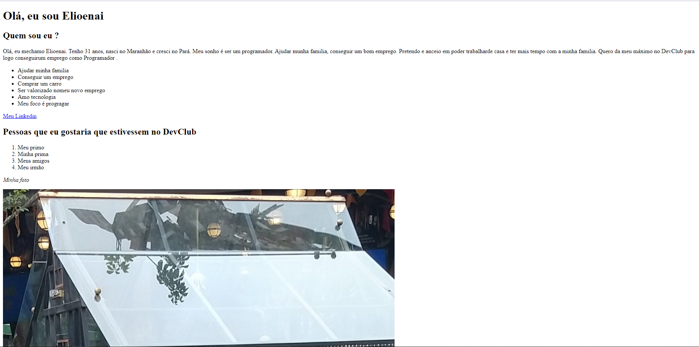

# Primeiro Desafio HTML 

> Resultado do Desafio HTML

### Ajustes e melhorias

O projeto ainda está em desenvolvimento e as próximas atualizações serão voltadas nas seguintes tarefas:

- [x] Estrutura HTML pronta
- [ ] Estilizar o CSS

## 🤝 Colaboradores

Agradecemos às seguintes pessoas que contribuíram para este projeto:

<table>
  <tr>
    <td align="center">
      <a href="https://www.linkedin.com/in/elioenai-oliveira-costa-ancelmo">
         
        
          <b>Elioenai Ancelmo</b>
        
      </a>
    </td>
</table>

